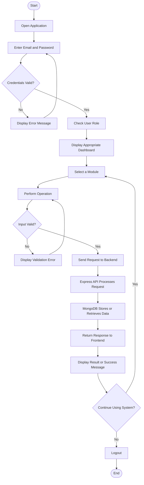

# Gym Management System – Application Workflow

```mermaid
flowchart TD
    A([Start]) --> B[Open Application]
    B --> C[Enter Email and Password]
    C --> D{Credentials Valid?}

    D -->|No| E[Display Error Message]
    E --> C

    D -->|Yes| F[Check User Role]
    F --> G[Display Appropriate Dashboard]
    G --> H[Select a Module]
    H --> I[Perform Operation]
    I --> J{Input Valid?}

    J -->|No| K[Display Validation Error]
    K --> I

    J -->|Yes| L[Send Request to Backend]
    L --> M[Express API Processes Request]
    M --> N[MongoDB Stores or Retrieves Data]
    N --> O[Return Response to Frontend]
    O --> P[Display Result or Success Message]
    P --> Q{Continue Using System?}

    Q -->|Yes| H
    Q -->|No| R[Logout]
    R --> S([End])
```
