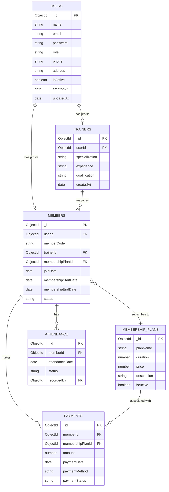

# Gym Management System – Entity Relationship Diagram

```mermaid
erDiagram
    USERS ||--o| MEMBERS : "has profile"
    USERS ||--o| TRAINERS : "has profile"
    TRAINERS ||--o{ MEMBERS : "manages"
    MEMBERS }o--|| MEMBERSHIP_PLANS : "subscribes to"
    MEMBERS ||--o{ ATTENDANCE : "has"
    MEMBERS ||--o{ PAYMENTS : "makes"
    MEMBERSHIP_PLANS ||--o{ PAYMENTS : "associated with"

    USERS {
        ObjectId _id PK
        string name
        string email
        string password
        string role
        string phone
        string address
        boolean isActive
        date createdAt
        date updatedAt
    }

    MEMBERS {
        ObjectId _id PK
        ObjectId userId FK
        string memberCode
        ObjectId trainerId FK
        ObjectId membershipPlanId FK
        date joinDate
        date membershipStartDate
        date membershipEndDate
        string status
    }

    TRAINERS {
        ObjectId _id PK
        ObjectId userId FK
        string specialization
        string experience
        string qualification
        date createdAt
    }

    MEMBERSHIP_PLANS {
        ObjectId _id PK
        string planName
        number duration
        number price
        string description
        boolean isActive
    }

    ATTENDANCE {
        ObjectId _id PK
        ObjectId memberId FK
        date attendanceDate
        string status
        ObjectId recordedBy FK
    }

    PAYMENTS {
        ObjectId _id PK
        ObjectId memberId FK
        ObjectId membershipPlanId FK
        number amount
        date paymentDate
        string paymentMethod
        string paymentStatus
    }
```
