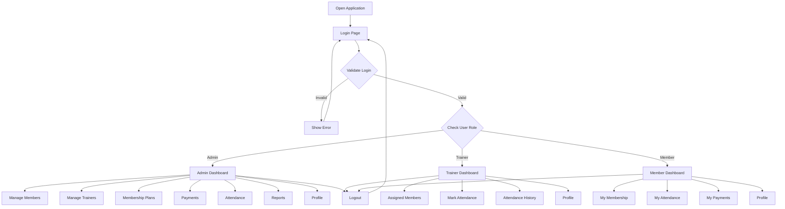

# Gym Management System – Navigation Flow

```mermaid
flowchart TD
    A[Open Application] --> B[Login Page]
    B --> C{Validate Login}
    C -->|Invalid| D[Show Error]
    D --> B
    C -->|Valid| E{Check User Role}

    E -->|Admin| F[Admin Dashboard]
    E -->|Trainer| G[Trainer Dashboard]
    E -->|Member| H[Member Dashboard]

    F --> F1[Manage Members]
    F --> F2[Manage Trainers]
    F --> F3[Membership Plans]
    F --> F4[Payments]
    F --> F5[Attendance]
    F --> F6[Reports]
    F --> F7[Profile]
    F --> Z[Logout]

    G --> G1[Assigned Members]
    G --> G2[Mark Attendance]
    G --> G3[Attendance History]
    G --> G4[Profile]
    G --> Z

    H --> H1[My Membership]
    H --> H2[My Attendance]
    H --> H3[My Payments]
    H --> H4[Profile]
    H --> Z

    Z --> B
```
